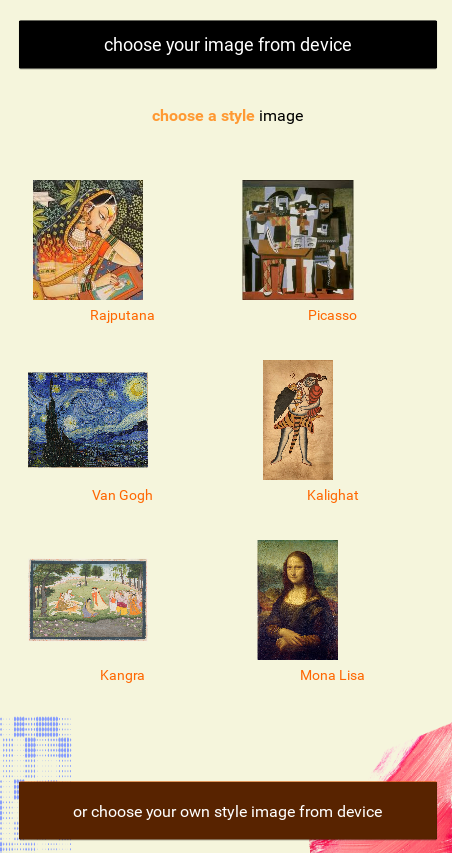

# Artify - AI Image Style Transfer App




> 🎨 Turn any image into artwork inspired by cultural legends and global masterpieces. Choose from built-in styles or add your own flair. Want to see yourself in a Picasso painting? Or a Van Gogh vision? With Artify, it's just one tap away. Choose your image, pick a style, and create frame-worthy art instantly.

---

## 📱 App Overview
Artify is a Kivy-based Android app that lets users:
- Upload any image from their device 📷
- Choose from a curated set of **art styles** (Rajput, Picasso, Van Gogh, etc.) or upload a custom style image 🎨
- Apply **Neural Style Transfer (NST)** using TensorFlow Lite
- Download and share the stylized result 🌟

---

## ✨ Features
- 🔍 Image selection from file system (content + style)
- 🧠 On-device neural style transfer using a `.tflite` model
- 🎨 Built-in curated art styles (Rajput, Madhubani, etc.)
- 📥 Download results with unique filenames
- 💡 Clean and artistic UI inspired by Indian color palette (Saffron, Beige, Deep Red)
- ⚙️ Smooth user experience with screen transitions and scrollable style gallery

---

## 📂 Folder Structure
```bash
Artify/
├── main.py                   # Core app logic
├── design.kv                 # Kivy UI layout
├── stylization_model.tflite # TFLite model for style transfer
├── styles/                   # Preloaded style reference images
```
---
🛠 Technologies Used

🖥️ UI/UX:
Kivy – Python framework for building cross-platform user interfaces
KV Language – Declarative syntax for responsive layout design
Custom Styling – Indian-themed color palette:
Saffron #FF9933
Light Beige #F5F5DC
Deep Red #A62A2A

🧠 AI / Machine Learning:
Neural Style Transfer:
Based on Google's Magenta Arbitrary Image Stylization model
Converted to TensorFlow Lite (.tflite) format for fast, offline inference
Model architecture: encoder-decoder transformer with VGG19-style content/style representations

📦 Android Packaging:
TensorFlow Lite Runtime – Lightweight inference engine bundled into app
Pillow + NumPy – For image preprocessing and manipulation

---

📦 Installation (For Devs)
# Clone repository
git clone https://github.com/yashSal-99/Artify.git
cd Artify

# Run on desktop (for testing only)
python main.py

# To build for Android
refer : https://github.com/yashSal-99/Python_kivy_to_apk_aab.git


---
🤖 Neural Style Transfer
Artify uses TensorFlow Hub’s NST model, converted into .tflite using TFLite Converter. The model accepts two inputs:

Content Image: the photo you want to stylize

Style Image: the reference art or painting

It outputs a new image, combining the structure of the content with the texture and colors of the style image — all running on-device.

